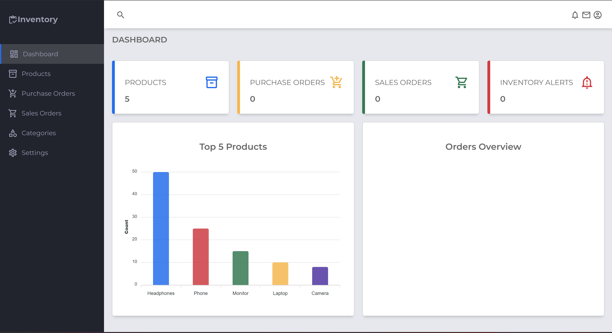

# Inventory Management System

A full-stack inventory management application built with Go (Golang) backend and CSV database, featuring a responsive frontend dashboard.

## Features

- **Dashboard** - Real-time statistics showing total products, purchase orders, sales orders, and inventory alerts
- **Products Management** - Add, edit, delete, and view products with SKU, category, quantity, and pricing
- **Categories** - Organize products into categories
- **Purchase & Sales Orders** - Track inventory flow with purchase and sales orders
- **Charts** - Visual representation of top products and order trends
- **CSV Database** - Simple file-based storage using CSV format

## Tech Stack

- **Backend**: Go (Golang)
- **Frontend**: HTML, CSS, JavaScript
- **Database**: CSV files
- **Router**: Gorilla Mux
- **Charts**: ApexCharts

## Dashboard Preview



## Project Structure

```
inventory/
├── main.go              # Server entry point
├── go.mod               # Go module dependencies
├── models/
│   └── models.go        # Data models (Product, Category, Order)
├── data/
│   └── csvdb.go         # CSV database operations
├── handlers/
│   └── handlers.go      # API route handlers
├── index.html           # Main frontend HTML
├── js/
│   └── scripts.js       # Frontend JavaScript
├── css/
│   └── styles.css       # Frontend styles
└── images/              # Static images
```

## API Endpoints

### Products
- `GET /api/products` - List all products
- `POST /api/products` - Create new product
- `GET /api/products/{id}` - Get product by ID
- `PUT /api/products/{id}` - Update product
- `DELETE /api/products/{id}` - Delete product

### Categories
- `GET /api/categories` - List all categories
- `POST /api/categories` - Create new category

### Orders
- `GET /api/orders` - List all orders
- `POST /api/orders` - Create new order

### Dashboard
- `GET /api/dashboard/stats` - Get dashboard statistics
- `GET /api/dashboard/top-products` - Get top 5 products

## Running the Application

1. **Install Go dependencies:**
   ```bash
   go mod tidy
   ```

2. **Run the server:**
   ```bash
   go run main.go
   ```

3. **Open browser:**
   Navigate to `http://localhost:8080`

## Sample Data

The application automatically creates sample data on first run:
- 3 Categories: Electronics, Office Supplies, Furniture
- 5 Products: Laptop, Phone, Monitor, Headphones, Camera

## Configuration

- **Port**: Default is `8080`. Change via `PORT` environment variable:
  ```bash
  PORT=3000 go run main.go
  ```

## Data Storage

Data is stored in CSV files in the `data/` directory:
- `data/products.csv` - Product records
- `data/categories.csv` - Category records
- `data/orders.csv` - Order records

## License

MIT License
